== FlexLayout

A layout component that implements https://developer.mozilla.org/en-US/docs/Web/CSS/CSS_Flexible_Box_Layout/Using_CSS_flexible_boxes[Flexbox] and enables full control over placement and styling of enclosed components using CSS. It uses the default https://developer.mozilla.org/en-US/docs/Web/CSS/flex-direction[flex-direction] and doesn't have any predetermined width or height.

=== FlexDirection

The `flexDirection` attribute cooresponds to the CSS https://developer.mozilla.org/en-US/docs/Web/CSS/flex-direction[flex-direction] property which defines how flex items are placed in the flex container, thus defining the main axis and the direction  (normal or reversed).

[cols="1,1"]
|===
|Value |Descsription

|`ROW` (default)
|The items are displayed horizontally, as a row.

|`ROW_REVERSE`
|The items are displayed horizontally, as a row in reverse order.

|`COLUMN`
|The items are displayed vertically, as a column.

|`COLUMN_REVERSE`
|The items are displayed vertically, as a column in reverse order.
|===

[source,xml]
----
<flexLayout flexDirection="ROW" css="gap: 0.5em">
    <button text="Button 1"/>
    <button text="Button 2"/>
    <button text="Button 3"/>
</flexLayout>
----

.Flex Layout with flexDirection="ROW"
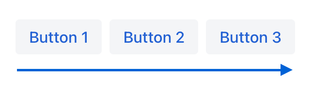

[source,xml]
----
<flexLayout flexDirection="ROW_REVERSE" css="gap: 0.5em">
    <button text="Button 1"/>
    <button text="Button 2"/>
    <button text="Button 3"/>
</flexLayout>
----

.Flex Layout with flexDirection="ROW_REVERSE"
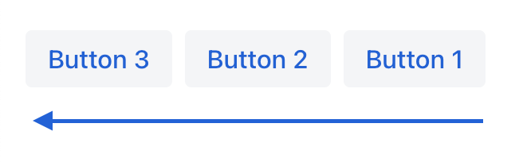

[source,xml]
----
<flexLayout flexDirection="COLUMN">
    <button text="Button 1"/>
    <button text="Button 2"/>
    <button text="Button 3"/>
</flexLayout>
----

.Flex Layout with flexDirection="COLUMN"
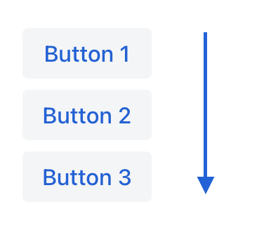

[source,xml]
----
<flexLayout flexDirection="COLUMN_REVERSE">
    <button text="Button 1"/>
    <button text="Button 2"/>
    <button text="Button 3"/>
</flexLayout>
----

.Flex Layout with flexDirection="COLUMN_REVERSE"
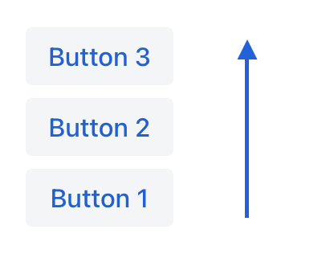

=== FlexWrap

The `flexWrap` attribute cooresponds to the CSS https://developer.mozilla.org/en-US/docs/Web/CSS/flex-wrap[flex-wrap] property which defines whether flex items are forced onto one line or can wrap onto multiple lines. If wrapping is allowed, it sets the direction that lines are stacked.

[cols="1,1"]
|===
|Value |Descsription

|`NOWRAP` (default)
|The flex items are laid out in a single line which may cause the flex container to overflow.

|`WRAP`
|The flex items break into multiple lines.

|`WRAP_REVERSE`
|The flex items break into multiple lines in reverse order.
|===

[source,xml]
----
<flexLayout flexWrap="NOWRAP"
            css="gap: 0.5em" width="20em">
    <button text="Button 1" width="9em"/>
    <button text="Button 2" width="9em"/>
    <button text="Button 3" width="9em"/>
</flexLayout>
----

.Flex Layout with flexWrap="NOWRAP"
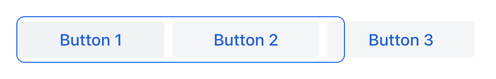

[source,xml]
----
<flexLayout flexWrap="WRAP"
            css="gap: 0.5em" width="20em">
    <button text="Button 1" width="9em"/>
    <button text="Button 2" width="9em"/>
    <button text="Button 3" width="9em"/>
</flexLayout>
----

.Flex Layout with flexWrap="WRAP"
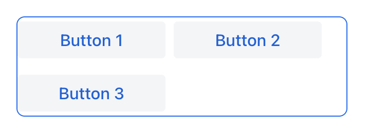

[source,xml]
----
<flexLayout flexWrap="WRAP_REVERSE"
            css="gap: 0.5em" width="20em">
    <button text="Button 1" width="9em"/>
    <button text="Button 2" width="9em"/>
    <button text="Button 3" width="9em"/>
</flexLayout>
----

.Flex Layout with flexWrap="WRAP_REVERSE"
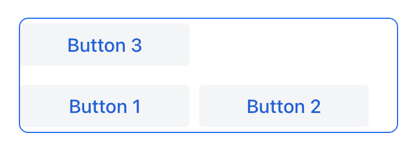

=== JustifyContentMode

The `justifyContent` attribute cooresponds to the CSS https://developer.mozilla.org/en-US/docs/Web/CSS/justify-content[justify-content] property which defines how the browser distributes space between and around content items along the *main-axis* of a flex container.

[cols="1,1"]
|===
|Value |Descsription

|`START` (default)
|Items are positioned at the beginning of the container.

|`CENTER`
|Items are positioned at the center of the container.

|`END`
|Items are positioned at the end of the container.

|`BETWEEN`
|Items are positioned with space between the lines; first item is on the start line, last item on the end line.

|`AROUND`
|Items are evenly positioned in the line with equal space around them. Note that start and end gaps are half the size of the space between each item.

|`EVENLY`
|Items are positioned so that the spacing between any two items (and the space to the edges) is equal.
|===

=== AlignItems

The `alignItems` attribute cooresponds to the CSS https://developer.mozilla.org/en-US/docs/Web/CSS/align-items[align-items] property which defines the default behavior for how flex items are placed out along the cross axis on the current line. Think of it as the `justify-content` version for the *cross-axis* (perpendicular to the *main-axis*).

[cols="1,1"]
|===
|Value |Descsription

|`START`
|Items are placed at the start of the cross axis.

|`CENTER`
|Items are centered in the cross-axis.

|`END`
|Items are placed at the end of the cross axis.

|`STRETCH`
|Items with *undefined size along the cross axis* are stretched to fit the container.

|`BASELINE`
|Items are positioned at the baseline of the container. Works for `flex-direction: row` only

|`AUTO`
|The element inherits its parent container's align-items property, or "stretch" if it has no parent container.
|===

=== ContentAlignment

The `contentAlignment` attribute cooresponds to the CSS https://developer.mozilla.org/en-US/docs/Web/CSS/align-content[align-content] property which defines the align of a flex container's lines within when there is extra space in the *cross-axis*, similar to how `justify-content` aligns individual items within the *main-axis*.

NOTE: This property only takes effect on *multi-line* flexible containers, where `flex-wrap` is set to either `wrap` or `wrap-reverse`). A *single-line* flexible container (i.e. where `flex-wrap` is set to its default value, `no-wrap`) will not reflect `align-content`.

[cols="1,1"]
|===
|Value |Descsription

|`START`
|Items are positioned at the beginning of the container.

|`CENTER`
|Items are positioned at the center of the container.

|`END`
|Items are positioned at the end of the container.

|`STRETCH`
|Items are stretched to fit the container.

|`SPACE_BETWEEN`
|Items are distributed evenly inside the container. The first item is flush with the start, the last is flush with the end.

|`SPACE_AROUND`
|Items are distributed evenly inside the container. Items have a half-size space on either end.
|===

[source,xml]
----
<flexLayout contentAlignment="START"
            css="gap: 0.5em"
            width="20em" minHeight="10em"
            flexWrap="WRAP">
    <button text="Button" width="9em"/>
    <button text="Button" width="9em"/>
    <button text="Button" width="9em"/>
</flexLayout>
----

.Flex Layout with contentAlignment="START"
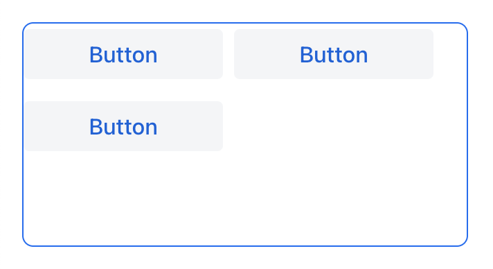

[source,xml]
----
<flexLayout contentAlignment="CENTER"
            css="gap: 0.5em"
            width="20em" minHeight="10em"
            flexWrap="WRAP">
    <button text="Button" width="9em"/>
    <button text="Button" width="9em"/>
    <button text="Button" width="9em"/>
</flexLayout>
----

.Flex Layout with contentAlignment="CENTER"
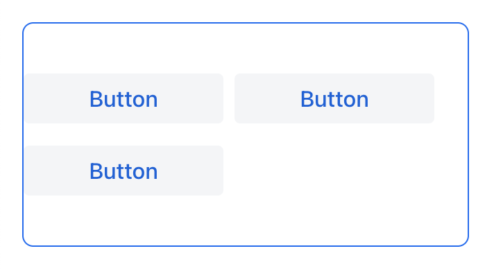

[source,xml]
----
<flexLayout contentAlignment="END"
            css="gap: 0.5em"
            width="20em" minHeight="10em"
            flexWrap="WRAP">
    <button text="Button" width="9em"/>
    <button text="Button" width="9em"/>
    <button text="Button" width="9em"/>
</flexLayout>
----

.Flex Layout with contentAlignment="END"
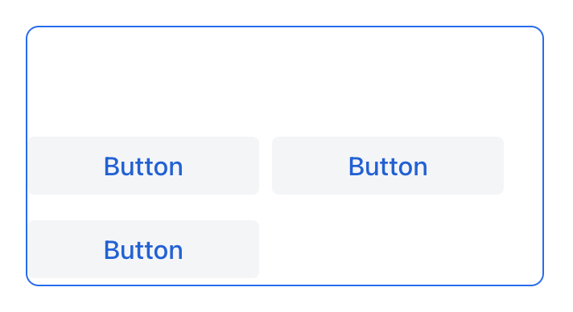

[source,xml]
----
<flexLayout contentAlignment="STRETCH"
            css="gap: 0.5em"
            width="20em" minHeight="10em"
            flexWrap="WRAP">
    <button text="Button" width="9em" height="AUTO"/>
    <button text="Button" width="9em" height="AUTO"/>
    <button text="Button" width="9em" height="AUTO"/>
</flexLayout>
----

.Flex Layout with contentAlignment="STRETCH"
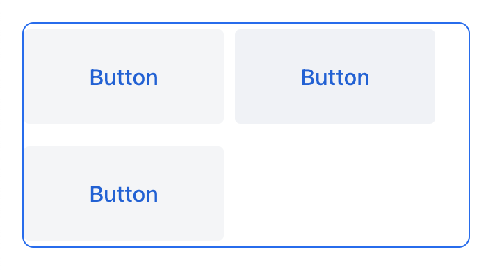

[source,xml]
----
<flexLayout contentAlignment="SPACE_BETWEEN"
            css="gap: 0.5em"
            width="20em" minHeight="10em"
            flexWrap="WRAP">
    <button text="Button" width="9em"/>
    <button text="Button" width="9em"/>
    <button text="Button" width="9em"/>
</flexLayout>
----

.Flex Layout with contentAlignment="SPACE_BETWEEN"
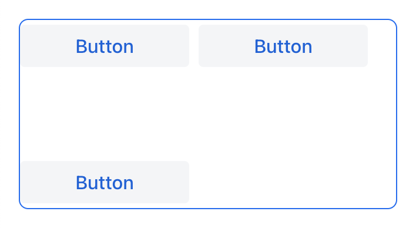

[source,xml]
----
<flexLayout contentAlignment="SPACE_AROUND"
            css="gap: 0.5em"
            width="20em" minHeight="10em"
            flexWrap="WRAP">
    <button text="Button" width="9em"/>
    <button text="Button" width="9em"/>
    <button text="Button" width="9em"/>
</flexLayout>
----

.Flex Layout with contentAlignment="SPACE_AROUND"
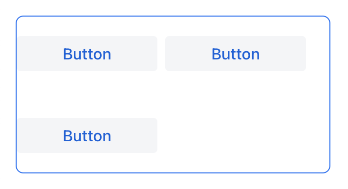
