= Layout Rules

== Component Sizes

Components that implement `com.vaadin.flow.component.HasSize` have the following attributes: `width`, `minWidth`, `maxWidth`, `height`, `minHeight`, `maxHeight`. These properties map directly to the CSS properties `width`, `min-width`, `max-width`, `height`, `min-height` and `max-height`.

Component dimensions, can be of the following types:

* Content-based - `AUTO`
* Fixed, e.g. `25em`
* Relative (percent), e.g. `100%`

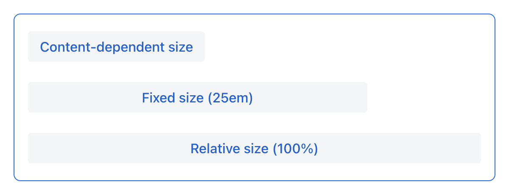

=== Content-dependent size

The component will take enough space to fit its content.

Examples:

* For `Button`, the size is defined by `text` length.
* For containers, the size is defined by the sum of all component sizes inside a container.

.XML
[source,xml]
----
<button text="Button" width="AUTO"/>
----

.Java
[source,java]
----
button.setWidth("AUTO");
----

Components with content-dependent size will adjust their dimensions during screen layout initialization or when the content size is changed.

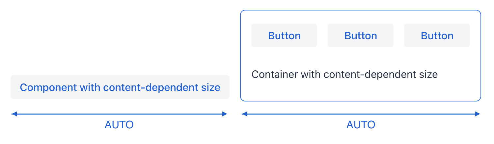

=== Fixed size

Fixed size implies that the component dimensions will not change at runtime.

.XML
[source,xml]
----
<vbox width="20em" height="15em"/>
----

.java
[source,java]
----
vBox.setWidth("20em");
vBox.setHeight("15em");
----

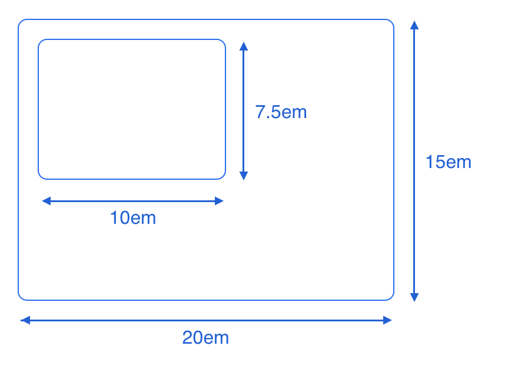

=== Relative size

Relative size indicates the percentage of available space that will be occupied by the component.

.XML
[source,xml]
----
<button text="Button" width="50%"/>
----

.java
[source,java]
----
button.setWidth("50%");
----

Components with relative size will react to changes in the amount of the available space and adjust their actual size on the screen.

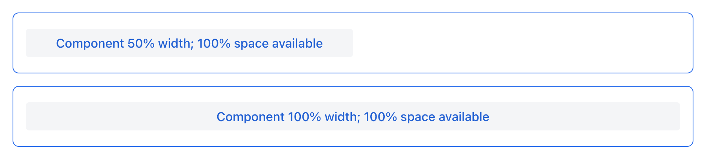

=== Container specifics

// TODO:

=== Component specifics

// TODO:

=== The expand option

// TODO:

== Margin, Spacing, Padding

Certain container support defining the empty space around and inside them.

=== Spacing

The `spacing` attribute indicates whether the space should be added between nested components in the direction of the container expansion.

.Horizontal Layout without spacing
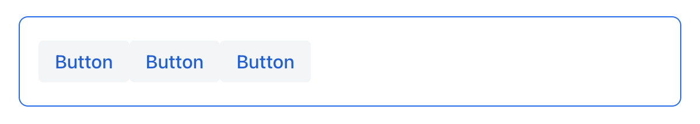

.Horizontal Layout with default spacing
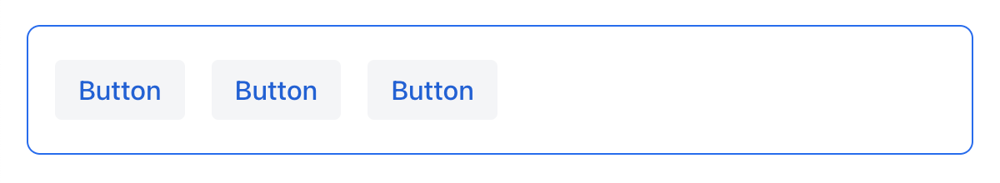

.Vertical Layout with default spacing
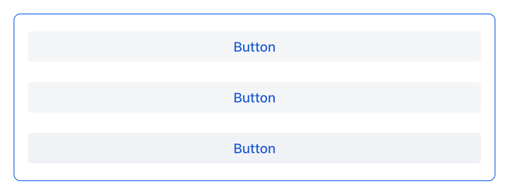

*Spacing* is enabled by defaulf for `HorizontalLayout` and `VerticalLayout` components.

==== Spacing Variants

Five different spacing theme variants are available:

[cols="1,1"]
|===
|Theme Variant |Usage Recommendation

|`spacing-xs`
| Extra-small space between items

|`spacing-s`
| Small space between items

|`spacing`
| Medium space between items

|`spacing-l`
| Large space between items

|`spacing-xl`
| Extra-large space between items
|===

Defining `spacing="true"` adds medium spacing to the component theme. To set other options, use the `getThemeList()` method, e.g:

[source,java]
----
@ViewComponent
private VerticalLayout vBox;

@Subscribe
public void onInit(final InitEvent event) {
    vBox.getThemeList().add("spacing-xl");
}
----

.Vertical Layout with spacing-lg theme variant
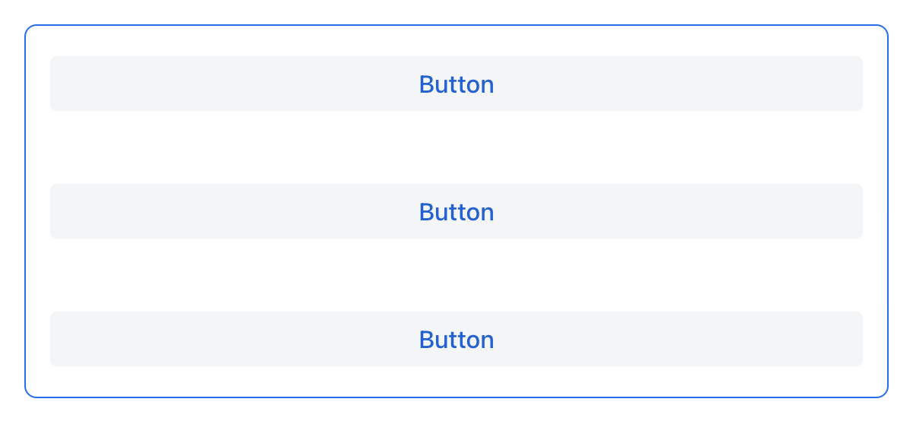

=== Padding

The `padding` attribute enables setting space between container borders and nested components.

.Vertical Layout with padding
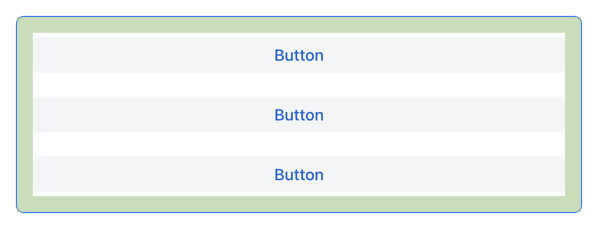

*Padding* is enabled by defaulf for `VerticalLayout`.

=== Margin

The `margin` attribute enables setting space around container borders.

.Vertical Layout with padding
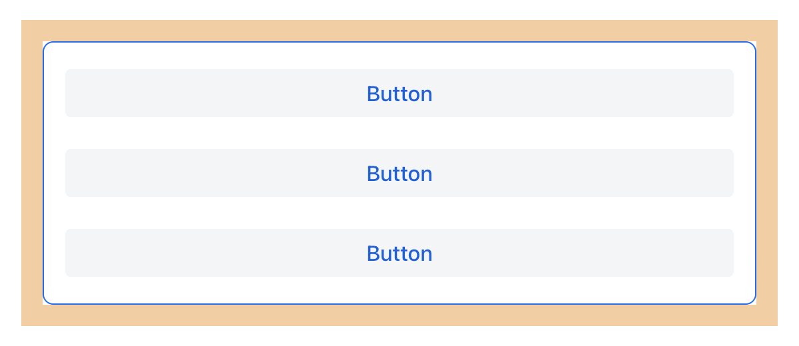

*Margin* is disabled by defaulf.

== Alignment

=== JustifyContentMode

The `justifyContent` attribute cooresponds to the CSS `justify-content` property which defines how the browser distributes space between and around content items along the *main-axis* of a flex container.

[cols="1,1"]
|===
|Value |Descsription

|`START` (defautl)
|Items are positioned at the beginning of the container.

|`CENTER`
|Items are positioned at the center of the container.

|`END`
|Items are positioned at the end of the container.

|`BETWEEN`
|Items are positioned with space between the lines; first item is on the start line, last item on the end line.

|`AROUND`
|Items are evenly positioned in the line with equal space around them. Note that start and end gaps are half the size of the space between each item.

|`EVENLY`
|Items are positioned so that the spacing between any two items (and the space to the edges) is equal.
|===

If `flex-direction: column` which corresponds to `VerticalLayout` and `FlexLayout` with `flexDirection="COLUMN"` then `justifyContent` attribute works as follows:

.Vertical Layout with justifyContent="START"
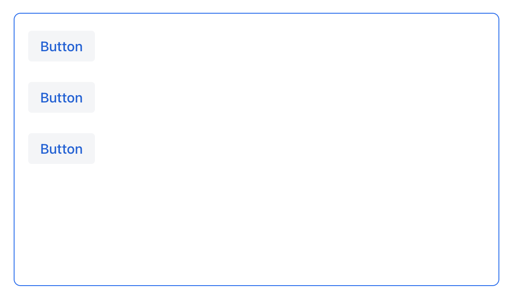

.Vertical Layout with justifyContent="CENTER"
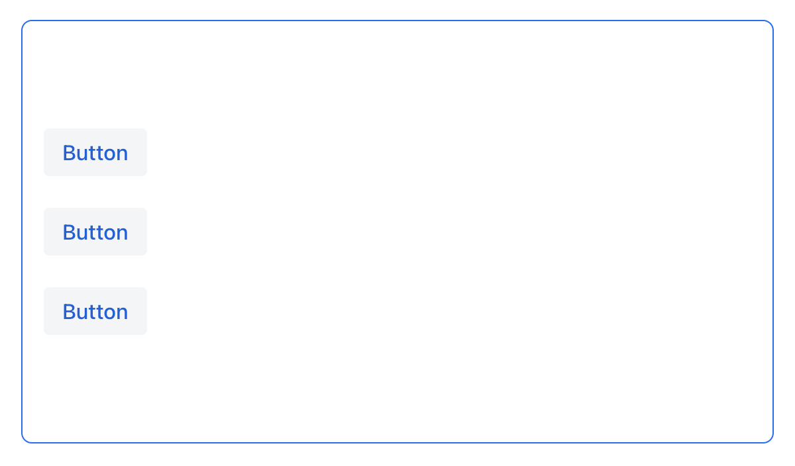

.Vertical Layout with justifyContent="END"
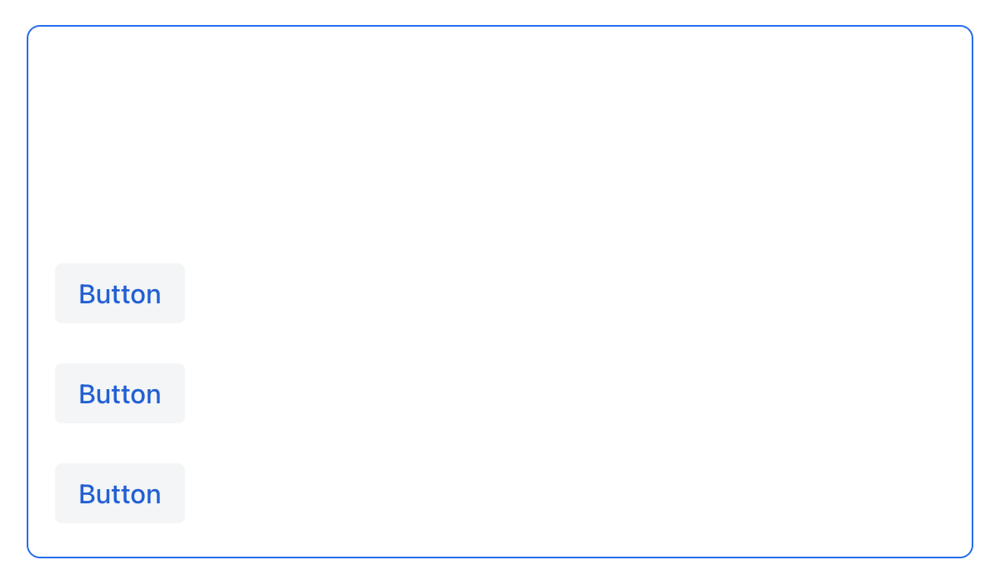

.Vertical Layout with justifyContent="BETWEEN"
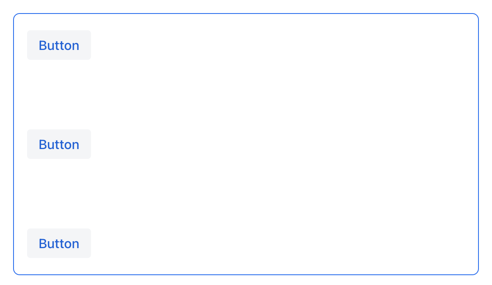

.Vertical Layout with justifyContent="AROUND"
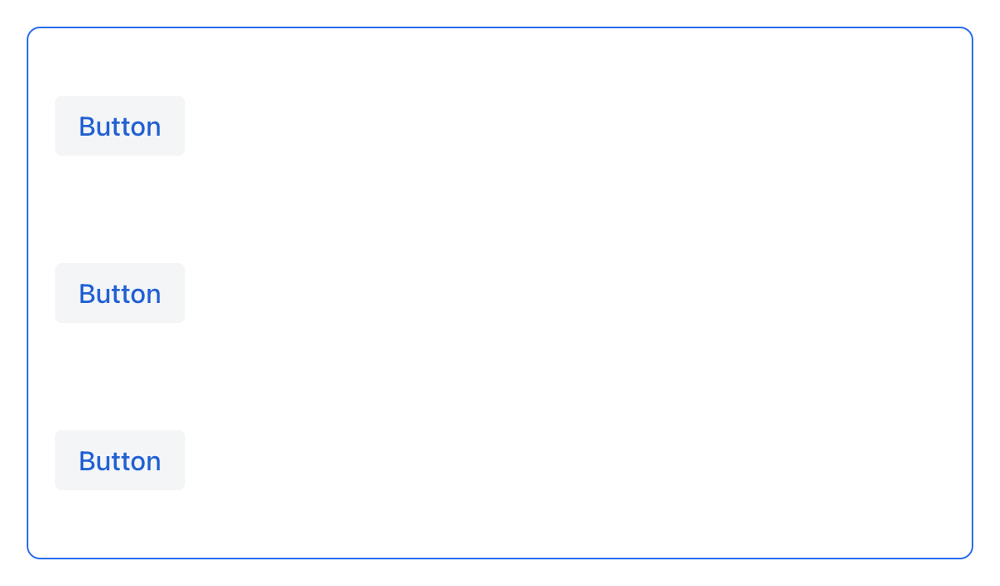

.Vertical Layout with justifyContent="EVENLY"
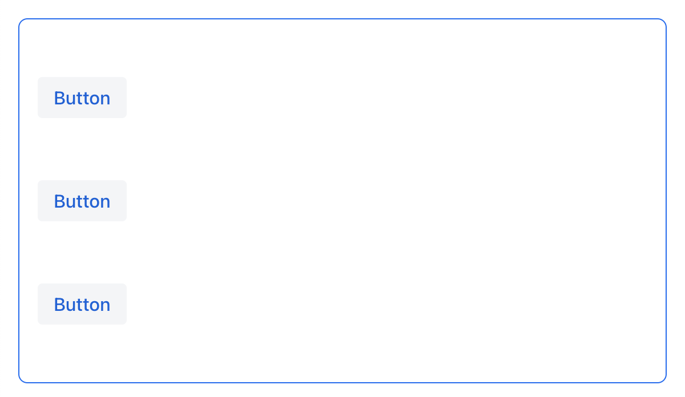

If `flex-direction: row` which corresponds to `HorizontalLayout` and `FlexLayout` with `flexDirection="ROW"` then `justifyContent` attribute works as follows:

.Horizontal Layout with justifyContent="START"
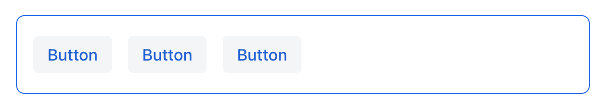

.Horizontal Layout with justifyContent="CENTER"
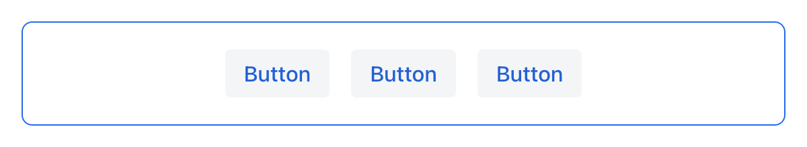

.Horizontal Layout with justifyContent="END"
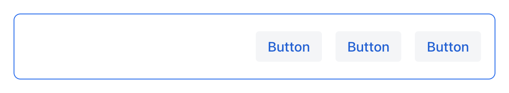

.Horizontal Layout with justifyContent="BETWEEN"
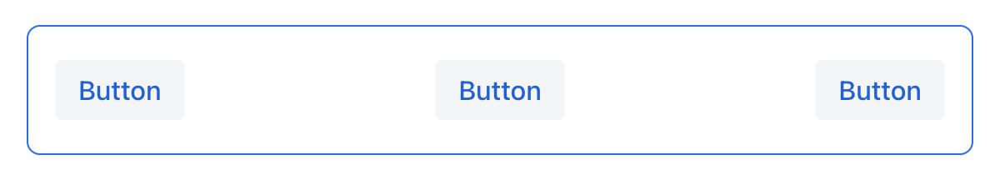

.Horizontal Layout with justifyContent="AROUND"
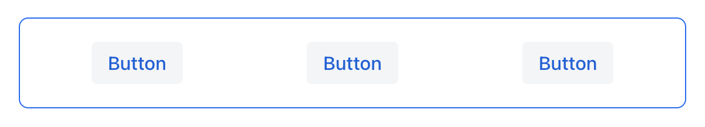

.Horizontal Layout with justifyContent="EVENLY"
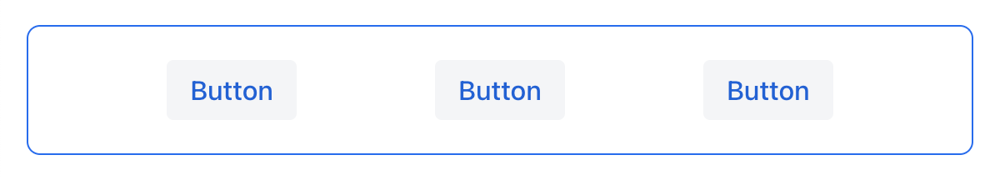

=== AlignItems

The `alignItems` attribute cooresponds to the CSS `align-items` property which defines the default behavior for how flex items are placed out along the cross axis on the current line. Think of it as the `justify-content` version for the *cross-axis* (perpendicular to the *main-axis*).

[cols="1,1"]
|===
|Value |Descsription

|`START`
|Items are placed at the start of the cross axis.

|`CENTER`
|Items are centered in the cross-axis.

|`END`
|Items are placed at the end of the cross axis.

|`STRETCH`
|Items with *undefined size along the cross axis* are stretched to fit the container.

|`BASELINE`
|Items are positioned at the baseline of the container. Works for `flex-direction: row` only

|`AUTO`
|The element inherits its parent container's align-items property, or "stretch" if it has no parent container.
|===

If `flex-direction: column` which corresponds to `VerticalLayout` and `FlexLayout` with `flexDirection="COLUMN"` then `justifyContent` attribute works as follows:

.Vertical Layout with alignItems="START"
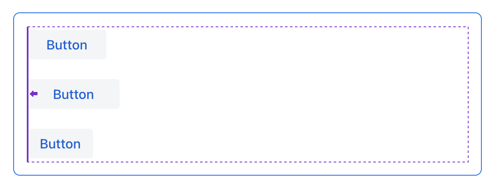

.Vertical Layout with alignItems="CENTER"
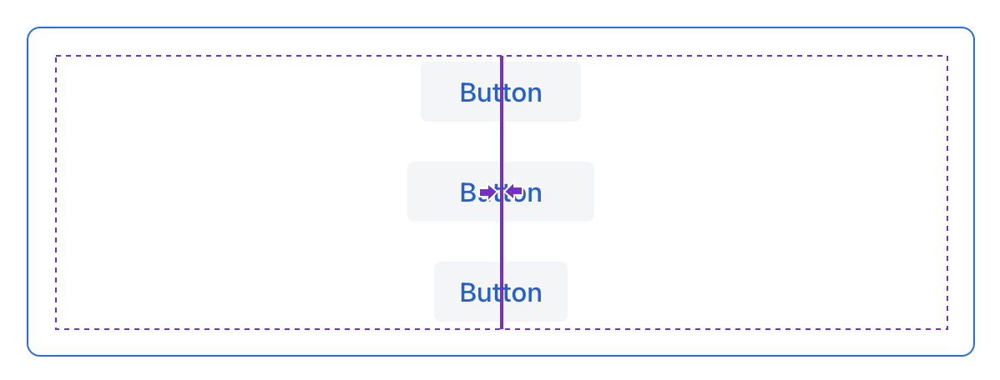

.Vertical Layout with alignItems="END"
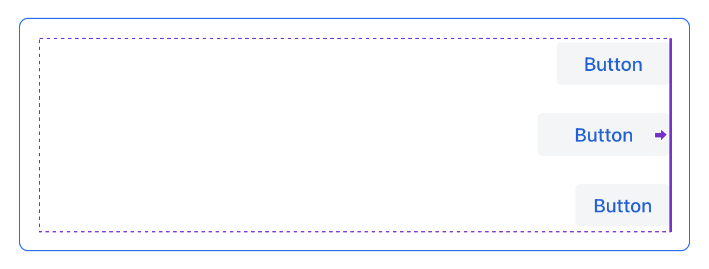

.Vertical Layout with alignItems="STRETCH"
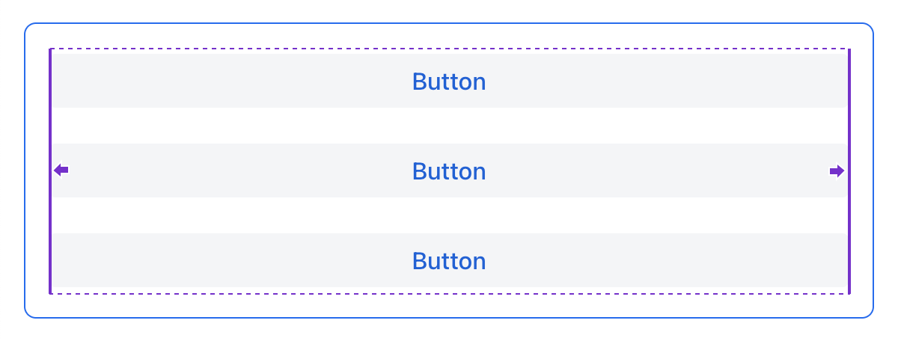

If `flex-direction: row` which corresponds to `HorizontalLayout` and `FlexLayout` with `flexDirection="ROW"` then `justifyContent` attribute works as follows:

.Horizontal Layout with alignItems="START"
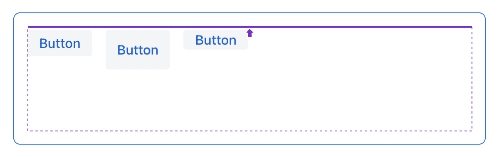

.Horizontal Layout with alignItems="CENTER"
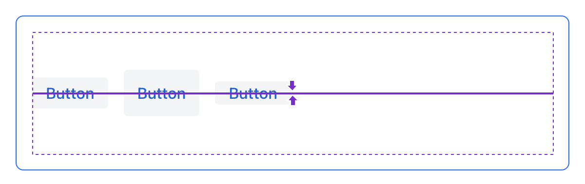

.Horizontal Layout with alignItems="END"
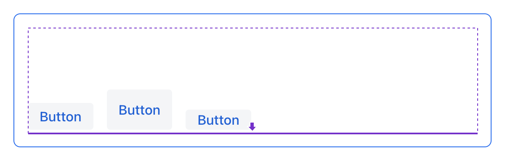

.Horizontal Layout with alignItems="STRETCH"
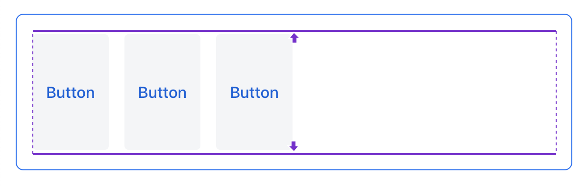

.Horizontal Layout with alignItems="BASELINE"
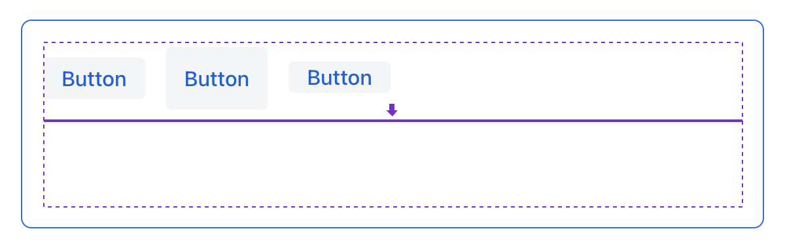

=== AlignSelf

// TODO: make sense when `alignSelf` will be available in XML

The `alignSelf` attribute cooresponds to the CSS `align-self` property which defines an alignment for individual components inside the container. This individual alignment for the component overrides any alignment set by `alignItems`.

// TODO: add examples

== Common Layout Mistakes

margin-right, -left
stretch without undefined size

width=100% instead of stretch in case of margins?

== FLEX CONTAINER
