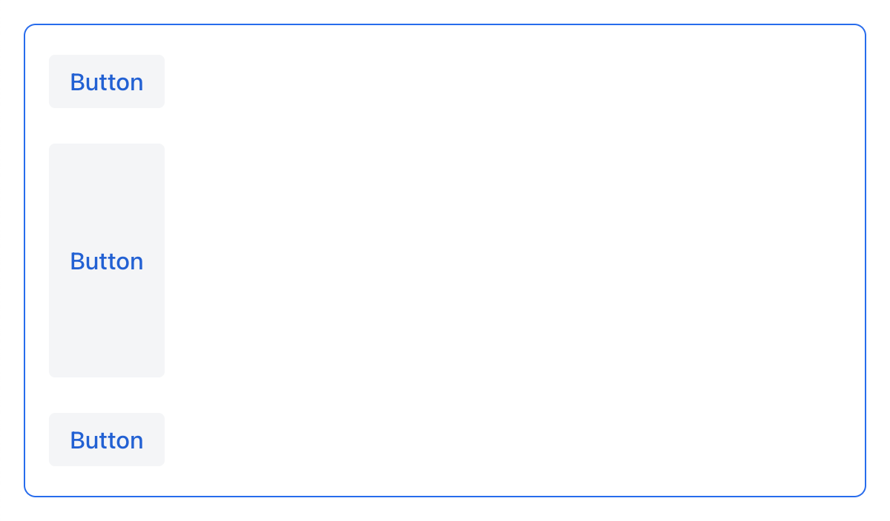
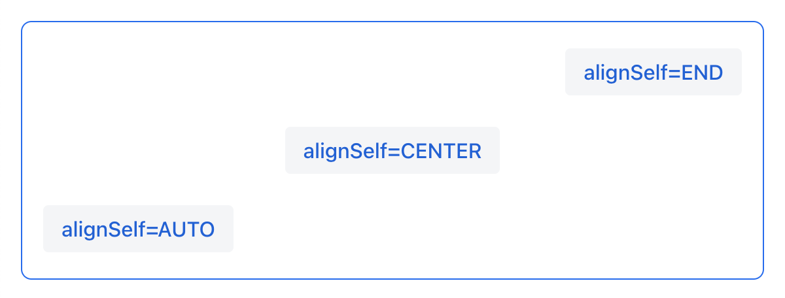
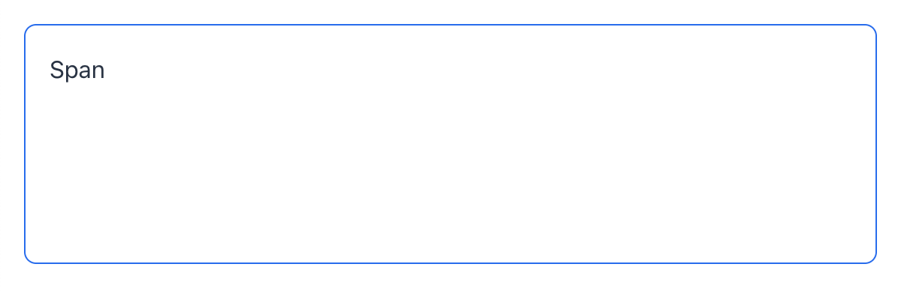
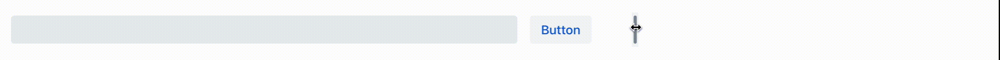

= Layout Rules

== Component Sizes

Components that implement `com.vaadin.flow.component.HasSize` (e.g. `button`, `textField`, `dataGrid`, `vbox`, etc.) have the following attributes: `width`, `minWidth`, `maxWidth`, `height`, `minHeight`, `maxHeight`. These properties map directly to the CSS properties https://developer.mozilla.org/en-US/docs/Web/CSS/width[width], https://developer.mozilla.org/en-US/docs/Web/CSS/min-width[min-width], https://developer.mozilla.org/en-US/docs/Web/CSS/max-width[max-width], https://developer.mozilla.org/en-US/docs/Web/CSS/height[height], https://developer.mozilla.org/en-US/docs/Web/CSS/min-height[min-height] and https://developer.mozilla.org/en-US/docs/Web/CSS/max-height[max-height].

TIP: `min`/`max` size attributes allow setting minimum and maximum values for the `width` and `height` of a component. This is useful for creating responsive designs, where elements need to adapt to different screen sizes. These properties can also be used to control the size of components on a view and prevent them from overflowing or becoming too large. See <<tipsAndTricks, Tips and Tricks>> for practical example.

Component dimensions, can be of the following types:

* Content-based - `AUTO`
* Fixed, e.g. `25em`
* Relative (percent) to parent layout, e.g. `100%`

image::images/size-types.png[]

IMPORTANT: the size value must be a correct CSS size string

=== Content-based size

The component will take enough space to fit its content.

Examples:

* For `Button`, the size is defined by `text` length.
* For containers, the size is defined by the sum of all component sizes inside a container.

.XML
[source,xml]
----
<button text="Button" width="AUTO"/>
----

.Java
[source,java]
----
button.setWidth("AUTO");
----

Components with content-based size will adjust their dimensions during screen layout initialization or when the content size is changed.

image::images/content-based-size.png[]

=== Fixed size

Fixed size implies that the component dimensions will not change at runtime.

.XML
[source,xml]
----
<vbox width="20em" height="15em"/>
----

.Java
[source,java]
----
vBox.setWidth("20em");
vBox.setHeight("15em");
----

The size can be set using absolute length units (e.g. `px`) or relative length units (e.g. `em`). All platform views and components usues relative length units such as `em` and `rem` so it is possible to change the entire application size. For example,  `em` is the size unit that is relative to parent font size. By default, the font size is `16px`.

NOTE: For more information on length units, see https://developer.mozilla.org/en-US/docs/Learn/CSS/Building_blocks/Values_and_units[CSS values and units].

=== Relative size

Relative size indicates the percentage of available space that will be occupied by the component.

.XML
[source,xml]
----
<button text="Button" width="50%"/>
----

.Java
[source,java]
----
button.setWidth("50%");
----

Components with relative size will react to changes in the amount of the available space and adjust their actual size on the screen.

image::images/relative-size.png[]

=== Container specifics

The root `<layout>` element is a vertical container (`<vbox>`), which by default has 100% width and height.

`scroller` must have fixed or relative (but not `AUTO`) width and height. Components inside `scroller`, positioned in the scrolling direction, may not have relative dimensions.

=== Component specifics

There is no need to explicitly set `height="100%"` or expand `dataGrid` within `vbox` or root `<layout>` elements, because its https://developer.mozilla.org/en-US/docs/Web/CSS/flex-grow[flex-grow] css property is set to `1` (which means that by default it is already expanded in the parent layout), but it is recommended to set `minHeight` so that if there is not enough vertical space it won't be collapsed.

=== The expand option

Components can be made to expand and take up any excess space a layout may have.

[source,xml]
----
<hbox expand="btn" padding="true" width="100%">
    <button text="Button"/>
    <button id="btn" text="Button"/>
    <button text="Button"/>
</hbox>
----

.Horizontal Layout with expand
image::images/hbox-expand.png[]

[source,xml]
----
<vbox expand="btn" width="100%" minHeight="20em">
    <button text="Button"/>
    <button id="btn" text="Button"/>
    <button text="Button"/>
</vbox>
----

.Vertical Layout with expand

NOTE: expanding a component effectively means that the CSS https://developer.mozilla.org/en-US/docs/Web/CSS/flex-grow[flex-grow] attribute is set to `1`.

== Margin, Spacing, Padding

With margin, padding and spacing you can define an empty space around components and inside them.

=== Spacing

The `spacing` attribute toggles `spacing` theme setting for the component. If a theme supports this attribute, it will apply or remove spacing to the component.

.Horizontal Layout without spacing

.Horizontal Layout with default spacing
image::images/hbox-spacing.png[]

.Vertical Layout with default spacing
image::images/vbox-spacing.png[]

*Spacing* is on by default for `vbox` and `hbox` components.

==== Spacing variants

The `spacing` attribute implicitly adds medium spacing to the component theme, which is equivalent to defining `themeNames="spacing"`. To set other options, use the `themeNames` attribute explicitly. Five different spacing theme variants are available:

[cols="1,1"]
|===
|Theme Variant |Usage Recommendation

|`spacing-xs`
| Extra-small space between items

|`spacing-s`
| Small space between items

|`spacing`
| Medium space between items

|`spacing-l`
| Large space between items

|`spacing-xl`
| Extra-large space between items
|===

Example of adding `spacing-xl` stacing variant:

[source,java]
----
<vbox themeNames="spacing-xl" alignItems="STRETCH">
    <button text="Button"/>
    <button text="Button"/>
    <button text="Button"/>
</vbox>
----

.Vertical Layout with spacing-lg theme variant
image::images/vbox-spacing-lg.png[]

=== Padding

The `padding` attribute enables setting space between container borders and nested components.

.Vertical Layout with padding
image::images/vbox-padding.png[]

*Padding* is on by default for `vbox`. You can turn it off by setting the `padding` attribute to `false`. For `hbox`, padding is off by default and can be turned on by setting the `padding` attribute to `true`.

=== Margin

*Margin* is a space around container borders.

.Vertical Layout with padding
image::images/vbox-margin.png[]

*Margin* is disabled by default. You can enable it using the `margin` attribute."

== Alignment

=== JustifyContentMode

The `justifyContent` attribute cooresponds to the CSS https://developer.mozilla.org/en-US/docs/Web/CSS/justify-content[justify-content] property which defines how the browser distributes space between and around content items along the *main-axis* of a flex container.

[cols="1,1"]
|===
|Value |Descsription

|`START` (default)
|Items are positioned at the beginning of the container.

|`CENTER`
|Items are positioned at the center of the container.

|`END`
|Items are positioned at the end of the container.

|`BETWEEN`
|Items are positioned with space between the lines; first item is on the start line, last item on the end line.

|`AROUND`
|Items are evenly positioned in the line with equal space around them. Note that start and end gaps are half the size of the space between each item.

|`EVENLY`
|Items are positioned so that the spacing between any two items (and the space to the edges) is equal.
|===

If `flex-direction: column` which corresponds to `vbox` and `flexLayout` with `flexDirection="COLUMN"` then `justifyContent` attribute works as follows:

[source,xml]
----
<vbox justifyContent="START" minHeight="20em">
    <button text="Button"/>
    <button text="Button"/>
    <button text="Button"/>
</vbox>
----

.Vertical Layout with justifyContent="START"
image::images/vbox-justifyContent-start.png[]

[source,xml]
----
<vbox justifyContent="CENTER" minHeight="20em">
    <button text="Button"/>
    <button text="Button"/>
    <button text="Button"/>
</vbox>
----

.Vertical Layout with justifyContent="CENTER"

[source,xml]
----
<vbox justifyContent="END" minHeight="20em">
    <button text="Button"/>
    <button text="Button"/>
    <button text="Button"/>
</vbox>
----

.Vertical Layout with justifyContent="END"
image::images/vbox-justifyContent-end.png[]

[source,xml]
----
<vbox justifyContent="BETWEEN" minHeight="20em">
    <button text="Button"/>
    <button text="Button"/>
    <button text="Button"/>
</vbox>
----

.Vertical Layout with justifyContent="BETWEEN"
image::images/vbox-justifyContent-between.png[]

[source,xml]
----
<vbox justifyContent="AROUND" minHeight="20em">
    <button text="Button"/>
    <button text="Button"/>
    <button text="Button"/>
</vbox>
----

.Vertical Layout with justifyContent="AROUND"
image::images/vbox-justifyContent-around.png[]

[source,xml]
----

<vbox justifyContent="EVENLY" minHeight="20em">
    <button text="Button"/>
    <button text="Button"/>
    <button text="Button"/>
</vbox>
----

.Vertical Layout with justifyContent="EVENLY"
image::images/vbox-justifyContent-evenly.png[]

If `flex-direction: row` which corresponds to `hbox` and `flexLayout` with `flexDirection="ROW"` then `justifyContent` attribute works as follows:

[source,xml]
----
<hbox justifyContent="START" padding="true" width="100%">
    <button text="Button"/>
    <button text="Button"/>
    <button text="Button"/>
</hbox>
----

.Horizontal Layout with justifyContent="START"

[source,xml]
----
<hbox justifyContent="CENTER" padding="true" width="100%">
    <button text="Button"/>
    <button text="Button"/>
    <button text="Button"/>
</hbox>
----

.Horizontal Layout with justifyContent="CENTER"

[source,xml]
----
<hbox justifyContent="END" padding="true" width="100%">
    <button text="Button"/>
    <button text="Button"/>
    <button text="Button"/>
</hbox>
----

.Horizontal Layout with justifyContent="END"

[source,xml]
----
<hbox justifyContent="BETWEEN" padding="true" width="100%">
    <button text="Button"/>
    <button text="Button"/>
    <button text="Button"/>
</hbox>
----

.Horizontal Layout with justifyContent="BETWEEN"
image::images/hbox-justifyContent-between.png[]

[source,xml]
----
<hbox justifyContent="AROUND" padding="true" width="100%">
    <button text="Button"/>
    <button text="Button"/>
    <button text="Button"/>
</hbox>
----

.Horizontal Layout with justifyContent="AROUND"

[source,xml]
----
<hbox justifyContent="EVENLY" padding="true" width="100%">
    <button text="Button"/>
    <button text="Button"/>
    <button text="Button"/>
</hbox>
----

.Horizontal Layout with justifyContent="EVENLY"
image::images/hbox-justifyContent-evenly.png[]

=== AlignItems

The `alignItems` attribute cooresponds to the CSS https://developer.mozilla.org/en-US/docs/Web/CSS/align-items[align-items] property which defines the default behavior for how flex items are placed out along the cross axis on the current line. Think of it as the `justify-content` version for the *cross-axis* (perpendicular to the *main-axis*).

[cols="1,1"]
|===
|Value |Descsription

|`START`
|Items are placed at the start of the cross axis.

|`CENTER`
|Items are centered in the cross-axis.

|`END`
|Items are placed at the end of the cross axis.

|`STRETCH`
|Items with *undefined size along the cross axis* are stretched to fit the container.

|`BASELINE`
|Items are positioned at the baseline of the container. Works for `flex-direction: row` only

|`AUTO`
|The element inherits its parent container's align-items property, or "stretch" if it has no parent container.
|===

If `flex-direction: column` which corresponds to `vbox` and `flexLayout` with `flexDirection="COLUMN"` then `justifyContent` attribute works as follows:

[source,xml]
----
<vbox alignItems="START">
    <button text="Button" width="6em"/>
    <button text="Button" width="7em"/>
    <button text="Button" width="5em"/>
</vbox>
----

.Vertical Layout with alignItems="START"
image::images/vbox-alignItems-start.png[]

[source,xml]
----
<vbox alignItems="CENTER">
    <button text="Button" width="6em"/>
    <button text="Button" width="7em"/>
    <button text="Button" width="5em"/>
</vbox>
----

.Vertical Layout with alignItems="CENTER"
image::images/vbox-alignItems-center.png[]

[source,xml]
----
<vbox alignItems="END">
    <button text="Button" width="6em"/>
    <button text="Button" width="7em"/>
    <button text="Button" width="5em"/>
</vbox>
----

.Vertical Layout with alignItems="END"
image::images/vbox-alignItems-end.png[]

[source,xml]
----
<vbox alignItems="STRETCH">
    <button text="Button" width="AUTO"/>
    <button text="Button" width="AUTO"/>
    <button text="Button" width="AUTO"/>
</vbox>
----

.Vertical Layout with alignItems="STRETCH"
image::images/vbox-alignItems-stretch.png[]

If `flex-direction: row` which corresponds to `hbox` and `flexLayout` with `flexDirection="ROW"` then `justifyContent` attribute works as follows:

[source,xml]
----
<hbox alignItems="START" padding="true" width="100%" minHeight="10em">
    <button text="Button" height="2em"/>
    <button text="Button" height="3em"/>
    <button text="Button" height="1.5em"/>
</hbox>
----

.Horizontal Layout with alignItems="START"
image::images/hbox-alignItems-start.png[]

[source,xml]
----
<hbox alignItems="CENTER" padding="true" width="100%" minHeight="10em">
    <button text="Button" height="2em"/>
    <button text="Button" height="3em"/>
    <button text="Button" height="1.5em"/>
</hbox>
----

.Horizontal Layout with alignItems="CENTER"
image::images/hbox-alignItems-center.png[]

[source,xml]
----
<hbox alignItems="END" padding="true" width="100%" minHeight="10em">
    <button text="Button" height="2em"/>
    <button text="Button" height="3em"/>
    <button text="Button" height="1.5em"/>
</hbox>
----

.Horizontal Layout with alignItems="END"
image::images/hbox-alignItems-end.png[]

[source,xml]
----
<hbox alignItems="STRETCH" padding="true" width="100%" minHeight="10em">
    <button text="Button" height="AUTO"/>
    <button text="Button" height="AUTO"/>
    <button text="Button" height="AUTO"/>
</hbox>
----

.Horizontal Layout with alignItems="STRETCH"
image::images/hbox-alignItems-stretch.png[]

[source,xml]
----
<hbox alignItems="BASELINE" padding="true" width="100%" minHeight="10em">
    <button text="Button" height="2em"/>
    <button text="Button" height="3em"/>
    <button text="Button" height="1.5em"/>
</hbox>
----

.Horizontal Layout with alignItems="BASELINE"
image::images/hbox-alignItems-baseline.png[]

=== AlignSelf

The `alignSelf` attribute cooresponds to the CSS https://developer.mozilla.org/en-US/docs/Web/CSS/align-self[align-self] property which defines an alignment for individual components inside the container. This individual alignment for the component overrides any alignment set by `alignItems`.

[source,xml]
----
<vbox alignItems="START">
    <button text="alignSelf=END" alignSelf="END"/>
    <button text="alignSelf=CENTER" alignSelf="CENTER"/>
    <button text="alignSelf=AUTO" alignSelf="AUTO"/>
</vbox>
----

.Vertical Layout with alignItems="START" and different alignSelf for nested components

[source,xml]
----
<hbox alignItems="START" justifyContent="BETWEEN" padding="true" width="100%" minHeight="10em">
    <button text="alignSelf=END" alignSelf="END"/>
    <button text="alignSelf=CENTER" alignSelf="CENTER"/>
    <button text="alignSelf=AUTO" alignSelf="AUTO"/>
</hbox>
----

.Horizontal Layout with alignItems="START" and different alignSelf for nested components
image::images/hbox-alignSelf.png[]

== Common Layout Mistakes

*Common mistake 1. Setting relative size for a component within a container with content-based size*

.Example of incorrect layout:
[source,xml]
----
<vbox>
    <dataGrid id="usersDataGrid" dataContainer="usersDc"
              width="100%" height="100%">
        <actions/>
        <columns>
            <column property="firstName"/>
            <column property="lastName"/>
            <column property="username"/>
        </columns>
    </dataGrid>
</vbox>
----

In this example, `DataGrid` has 100% height, while the default height for `vbox` is `AUTO`, i.e. content-based. As a result, `DataGrid` is collapsed.

.Example of relative size for a component within a container with content-based size
image::images/dataGrid-relative-size.png[]

*Common mistake 2. Not disabling padding for nested `vbox` containers*

.Example of incorrect layout:
[source,xml]
----
<layout>
    <genericFilter ...>
        ...
    </genericFilter>

    <vbox width="100%">
        <hbox id="buttonsPanel" classNames="buttons-panel">
            ...
        </hbox>
        <dataGrid id="usersDataGrid" ...>
            ...
        </dataGrid>
    </vbox>
    <hbox>
        ...
    </hbox>
</layout>
----

In this example, `dataGrid` and corresponding `hbox` are placed inside a `vbox` which be default has padding enabled. As a result, components within `vbox` are not aligned with the others.

.Example of nested Vertical Layout with not disabled padding
image::images/vbox-incorrect-padding.png[]

*Common mistake 3. Aligning components with relative size*

.Example of incorrect layout:
[source,xml]
----
<hbox alignItems="CENTER" padding="true" width="100%" minHeight="10em">
    
</hbox>
----

In this example, `span` has 100% height within `hbox` container which defines `alignItems="CENTER"`. As a result, text is placed in the top left corner.

.Example of aligning components with relative size

*Common mistake 4. Stretching components with fixed size*

.Example of incorrect layout:
[source,xml]
----
<hbox alignItems="STRETCH" padding="true" width="100%" minHeight="10em">
    <button text="Button"/>
    <button text="Button"/>
    <button text="Button"/>
</hbox>
----

In this example, buttions have default height defined in styles. As a result, buttons are not stretched.

.Example of stretching components with fixed size
image::images/fixed-size-stretching.png[]

*Common mistake 5. Setting size without size unit*

.Example of incorrect size:
[source,xml]
----
<textField width="400"/>
----

In this example, `textField` has no size unit specified. As a result, the size value is ignored, because there is no default size unit.

== Tips and Tricks [[tipsAndTricks]]

An example of definig a responsive text field that has fixed size on big screens and 100% width on small ones

[source,xml]
----
<hbox width="100%">
    <textField width="100%" maxWidth="40em"/>
    <button text="Button"/>
</hbox>
----

