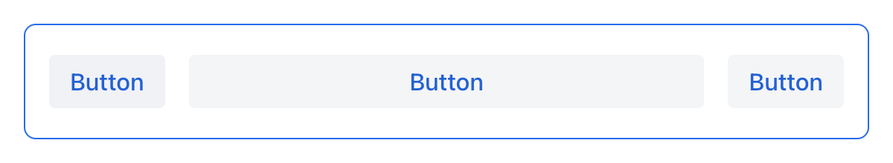
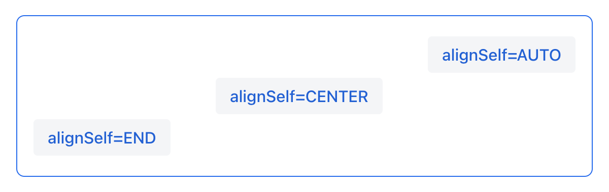
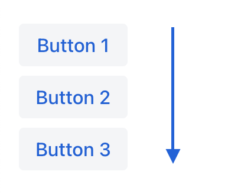
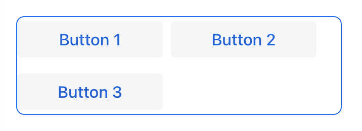
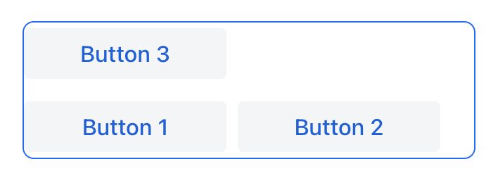
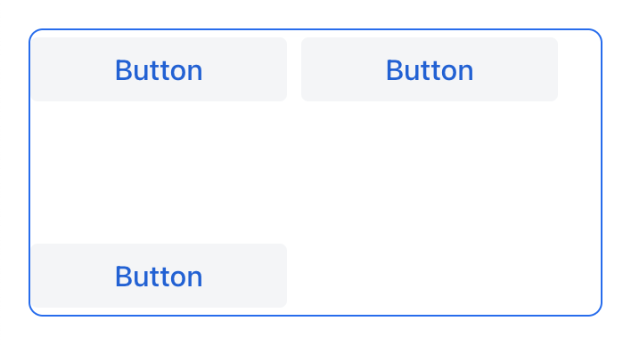
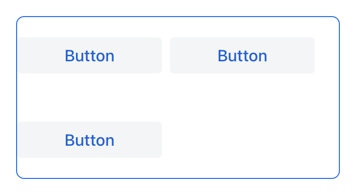

= Layout Rules

== Component Sizes

Components that implement `com.vaadin.flow.component.HasSize` have the following attributes: `width`, `minWidth`, `maxWidth`, `height`, `minHeight`, `maxHeight`. These properties map directly to the CSS properties https://developer.mozilla.org/en-US/docs/Web/CSS/width[width], https://developer.mozilla.org/en-US/docs/Web/CSS/min-width[min-width], https://developer.mozilla.org/en-US/docs/Web/CSS/max-width[max-width], https://developer.mozilla.org/en-US/docs/Web/CSS/height[height], https://developer.mozilla.org/en-US/docs/Web/CSS/min-height[min-height] and https://developer.mozilla.org/en-US/docs/Web/CSS/max-height[max-height].

Component dimensions, can be of the following types:

* Content-based - `AUTO`
* Fixed, e.g. `25em`
* Relative (percent), e.g. `100%`

image::images/size-types.png[]

NOTE: the size value must be a correct CSS size string

=== Content-dependent size

The component will take enough space to fit its content.

Examples:

* For `Button`, the size is defined by `text` length.
* For containers, the size is defined by the sum of all component sizes inside a container.

.XML
[source,xml]
----
<button text="Button" width="AUTO"/>
----

.Java
[source,java]
----
button.setWidth("AUTO");
----

Components with content-dependent size will adjust their dimensions during screen layout initialization or when the content size is changed.

=== Fixed size

Fixed size implies that the component dimensions will not change at runtime.

.XML
[source,xml]
----
<vbox width="20em" height="15em"/>
----

.Java
[source,java]
----
vBox.setWidth("20em");
vBox.setHeight("15em");
----

image::images/fixed-size.png[]

The size can be set using absolute length units (e.g. `px`) or relative length units (e.g. `em`). All platform views and components usues relative length units such as `em` and `rem` so it is possible to change the entire application size. For example,  `em` is the size unit that is relative to parent font size. By default, the font size is `16px`.

NOTE: For more information on length units, see https://developer.mozilla.org/en-US/docs/Learn/CSS/Building_blocks/Values_and_units[CSS values and units].

=== Relative size

Relative size indicates the percentage of available space that will be occupied by the component.

.XML
[source,xml]
----
<button text="Button" width="50%"/>
----

.Java
[source,java]
----
button.setWidth("50%");
----

Components with relative size will react to changes in the amount of the available space and adjust their actual size on the screen.

=== Container specifics

The root `<layout>` element is a vertical container (`<vbox>`), which by default has 100% width and height.

`Scroller` must have fixed or relative (but not `AUTO`) width and height. Components inside `Scroller`, positioned in the scrolling direction, may not have relative dimensions.

=== Component specifics

There is no need to explicitly set `height="100%"` or expand `DataGrid` within `VerticalLayout` or `ViewLayout`, because its https://developer.mozilla.org/en-US/docs/Web/CSS/flex-grow[flex-grow] css property is set to `1` (which means that by default it is already expanded in the parent layout), but it is recommended to set `minHeight` so that if there is not enough vertical space it won't be collapsed.

=== The expand option

Components can be made to expand and take up any excess space a layout may have.

[source,xml]
----
<hbox expand="btn" padding="true" width="100%">
    <button text="Button"/>
    <button id="btn" text="Button"/>
    <button text="Button"/>
</hbox>
----

.Horizontal Layout with expand

[source,xml]
----
<vbox expand="btn" width="100%" minHeight="20em">
    <button text="Button"/>
    <button id="btn" text="Button"/>
    <button text="Button"/>
</vbox>
----

.Vertical Layout with expand
image::images/vbox-expand.png[]

NOTE: expanding a component effectively means that the CSS https://developer.mozilla.org/en-US/docs/Web/CSS/flex-grow[flex-grow] attribute is set to `1`.

== Margin, Spacing, Padding

Certain container support defining the empty space around and inside them.

=== Spacing

The `spacing` attribute indicates whether the space should be added between nested components in the direction of the container expansion.

.Horizontal Layout without spacing
image::images/hbox-no-spacing.png[]

.Horizontal Layout with default spacing
image::images/hbox-spacing.png[]

.Vertical Layout with default spacing
image::images/vbox-spacing.png[]

*Spacing* is enabled by defaulf for `HorizontalLayout` and `VerticalLayout` components.

==== Spacing Variants

Five different spacing theme variants are available:

[cols="1,1"]
|===
|Theme Variant |Usage Recommendation

|`spacing-xs`
| Extra-small space between items

|`spacing-s`
| Small space between items

|`spacing`
| Medium space between items

|`spacing-l`
| Large space between items

|`spacing-xl`
| Extra-large space between items
|===

Defining `spacing="true"` adds medium spacing to the component theme. To set other options, use the `themeNames` attribute, e.g:

[source,java]
----
<vbox themeNames="spacing-xl" alignItems="STRETCH">
    <button text="Button"/>
    <button text="Button"/>
    <button text="Button"/>
</vbox>
----

.Vertical Layout with spacing-lg theme variant

=== Padding

The `padding` attribute enables setting space between container borders and nested components.

.Vertical Layout with padding

*Padding* is enabled by defaulf for `VerticalLayout`.

=== Margin

The `margin` attribute enables setting space around container borders.

.Vertical Layout with padding
image::images/vbox-margin.png[]

*Margin* is disabled by defaulf.

== Alignment

=== JustifyContentMode

The `justifyContent` attribute cooresponds to the CSS https://developer.mozilla.org/en-US/docs/Web/CSS/justify-content[justify-content] property which defines how the browser distributes space between and around content items along the *main-axis* of a flex container.

[cols="1,1"]
|===
|Value |Descsription

|`START` (default)
|Items are positioned at the beginning of the container.

|`CENTER`
|Items are positioned at the center of the container.

|`END`
|Items are positioned at the end of the container.

|`BETWEEN`
|Items are positioned with space between the lines; first item is on the start line, last item on the end line.

|`AROUND`
|Items are evenly positioned in the line with equal space around them. Note that start and end gaps are half the size of the space between each item.

|`EVENLY`
|Items are positioned so that the spacing between any two items (and the space to the edges) is equal.
|===

If `flex-direction: column` which corresponds to `VerticalLayout` and `FlexLayout` with `flexDirection="COLUMN"` then `justifyContent` attribute works as follows:

[source,xml]
----
<vbox justifyContent="START" minHeight="20em">
    <button text="Button"/>
    <button text="Button"/>
    <button text="Button"/>
</vbox>
----

.Vertical Layout with justifyContent="START"
image::images/vbox-justifyContent-start.png[]

[source,xml]
----
<vbox justifyContent="CENTER" minHeight="20em">
    <button text="Button"/>
    <button text="Button"/>
    <button text="Button"/>
</vbox>
----

.Vertical Layout with justifyContent="CENTER"
image::images/vbox-justifyContent-center.png[]

[source,xml]
----
<vbox justifyContent="END" minHeight="20em">
    <button text="Button"/>
    <button text="Button"/>
    <button text="Button"/>
</vbox>
----

.Vertical Layout with justifyContent="END"
image::images/vbox-justifyContent-end.png[]

[source,xml]
----
<vbox justifyContent="BETWEEN" minHeight="20em">
    <button text="Button"/>
    <button text="Button"/>
    <button text="Button"/>
</vbox>
----

.Vertical Layout with justifyContent="BETWEEN"
image::images/vbox-justifyContent-between.png[]

[source,xml]
----
<vbox justifyContent="AROUND" minHeight="20em">
    <button text="Button"/>
    <button text="Button"/>
    <button text="Button"/>
</vbox>
----

.Vertical Layout with justifyContent="AROUND"

[source,xml]
----

<vbox justifyContent="EVENLY" minHeight="20em">
    <button text="Button"/>
    <button text="Button"/>
    <button text="Button"/>
</vbox>
----

.Vertical Layout with justifyContent="EVENLY"
image::images/vbox-justifyContent-evenly.png[]

If `flex-direction: row` which corresponds to `HorizontalLayout` and `FlexLayout` with `flexDirection="ROW"` then `justifyContent` attribute works as follows:

[source,xml]
----
<hbox justifyContent="START" padding="true" width="100%">
    <button text="Button"/>
    <button text="Button"/>
    <button text="Button"/>
</hbox>
----

.Horizontal Layout with justifyContent="START"
image::images/hbox-justifyContent-start.png[]

[source,xml]
----
<hbox justifyContent="CENTER" padding="true" width="100%">
    <button text="Button"/>
    <button text="Button"/>
    <button text="Button"/>
</hbox>
----

.Horizontal Layout with justifyContent="CENTER"
image::images/hbox-justifyContent-center.png[]

[source,xml]
----
<hbox justifyContent="END" padding="true" width="100%">
    <button text="Button"/>
    <button text="Button"/>
    <button text="Button"/>
</hbox>
----

.Horizontal Layout with justifyContent="END"
image::images/hbox-justifyContent-end.png[]

[source,xml]
----
<hbox justifyContent="BETWEEN" padding="true" width="100%">
    <button text="Button"/>
    <button text="Button"/>
    <button text="Button"/>
</hbox>
----

.Horizontal Layout with justifyContent="BETWEEN"

[source,xml]
----
<hbox justifyContent="AROUND" padding="true" width="100%">
    <button text="Button"/>
    <button text="Button"/>
    <button text="Button"/>
</hbox>
----

.Horizontal Layout with justifyContent="AROUND"
image::images/hbox-justifyContent-around.png[]

[source,xml]
----
<hbox justifyContent="EVENLY" padding="true" width="100%">
    <button text="Button"/>
    <button text="Button"/>
    <button text="Button"/>
</hbox>
----

.Horizontal Layout with justifyContent="EVENLY"
image::images/hbox-justifyContent-evenly.png[]

=== AlignItems

The `alignItems` attribute cooresponds to the CSS https://developer.mozilla.org/en-US/docs/Web/CSS/align-items[align-items] property which defines the default behavior for how flex items are placed out along the cross axis on the current line. Think of it as the `justify-content` version for the *cross-axis* (perpendicular to the *main-axis*).

[cols="1,1"]
|===
|Value |Descsription

|`START`
|Items are placed at the start of the cross axis.

|`CENTER`
|Items are centered in the cross-axis.

|`END`
|Items are placed at the end of the cross axis.

|`STRETCH`
|Items with *undefined size along the cross axis* are stretched to fit the container.

|`BASELINE`
|Items are positioned at the baseline of the container. Works for `flex-direction: row` only

|`AUTO`
|The element inherits its parent container's align-items property, or "stretch" if it has no parent container.
|===

If `flex-direction: column` which corresponds to `VerticalLayout` and `FlexLayout` with `flexDirection="COLUMN"` then `justifyContent` attribute works as follows:

[source,xml]
----
<vbox alignItems="START">
    <button text="Button" width="6em"/>
    <button text="Button" width="7em"/>
    <button text="Button" width="5em"/>
</vbox>
----

.Vertical Layout with alignItems="START"
image::images/vbox-alignItems-start.png[]

[source,xml]
----
<vbox alignItems="CENTER">
    <button text="Button" width="6em"/>
    <button text="Button" width="7em"/>
    <button text="Button" width="5em"/>
</vbox>
----

.Vertical Layout with alignItems="CENTER"

[source,xml]
----
<vbox alignItems="END">
    <button text="Button" width="6em"/>
    <button text="Button" width="7em"/>
    <button text="Button" width="5em"/>
</vbox>
----

.Vertical Layout with alignItems="END"
image::images/vbox-alignItems-end.png[]

[source,xml]
----
<vbox alignItems="STRETCH">
    <button text="Button" width="AUTO"/>
    <button text="Button" width="AUTO"/>
    <button text="Button" width="AUTO"/>
</vbox>
----

.Vertical Layout with alignItems="STRETCH"
image::images/vbox-alignItems-stretch.png[]

If `flex-direction: row` which corresponds to `HorizontalLayout` and `FlexLayout` with `flexDirection="ROW"` then `justifyContent` attribute works as follows:

[source,xml]
----
<hbox alignItems="START" padding="true" width="100%" minHeight="10em">
    <button text="Button" height="2em"/>
    <button text="Button" height="3em"/>
    <button text="Button" height="1.5em"/>
</hbox>
----

.Horizontal Layout with alignItems="START"
image::images/hbox-alignItems-start.png[]

[source,xml]
----
<hbox alignItems="CENTER" padding="true" width="100%" minHeight="10em">
    <button text="Button" height="2em"/>
    <button text="Button" height="3em"/>
    <button text="Button" height="1.5em"/>
</hbox>
----

.Horizontal Layout with alignItems="CENTER"

[source,xml]
----
<hbox alignItems="END" padding="true" width="100%" minHeight="10em">
    <button text="Button" height="2em"/>
    <button text="Button" height="3em"/>
    <button text="Button" height="1.5em"/>
</hbox>
----

.Horizontal Layout with alignItems="END"
image::images/hbox-alignItems-end.png[]

[source,xml]
----
<hbox alignItems="STRETCH" padding="true" width="100%" minHeight="10em">
    <button text="Button" height="AUTO"/>
    <button text="Button" height="AUTO"/>
    <button text="Button" height="AUTO"/>
</hbox>
----

.Horizontal Layout with alignItems="STRETCH"
image::images/hbox-alignItems-stretch.png[]

[source,xml]
----
<hbox alignItems="BASELINE" padding="true" width="100%" minHeight="10em">
    <button text="Button" height="2em"/>
    <button text="Button" height="3em"/>
    <button text="Button" height="1.5em"/>
</hbox>
----

.Horizontal Layout with alignItems="BASELINE"

=== AlignSelf

The `alignSelf` attribute cooresponds to the CSS https://developer.mozilla.org/en-US/docs/Web/CSS/align-self[align-self] property which defines an alignment for individual components inside the container. This individual alignment for the component overrides any alignment set by `alignItems`.

[source,xml]
----
<vbox alignItems="START">
    <button text="alignSelf=END" alignSelf="END"/>
    <button text="alignSelf=CENTER" alignSelf="CENTER"/>
    <button text="alignSelf=AUTO" alignSelf="AUTO"/>
</vbox>
----

.Vertical Layout with alignItems="START" and different alignSelf for nested components
image::images/vbox-alignSelf.png[]

[source,xml]
----
<hbox alignItems="START" justifyContent="BETWEEN" padding="true" width="100%" minHeight="10em">
    <button text="alignSelf=END" alignSelf="END"/>
    <button text="alignSelf=CENTER" alignSelf="CENTER"/>
    <button text="alignSelf=AUTO" alignSelf="AUTO"/>
</hbox>
----

.Horizontal Layout with alignItems="START" and different alignSelf for nested components

== Common Layout Mistakes

// TODO: describe

margin-right, -left
stretch without undefined size

width=100% instead of stretch in case of margins?

not defining size unit

`Scroller` must have only one root component.

== FlexLayout

A layout component that implements https://developer.mozilla.org/en-US/docs/Web/CSS/CSS_Flexible_Box_Layout/Using_CSS_flexible_boxes[Flexbox]. It uses the default https://developer.mozilla.org/en-US/docs/Web/CSS/flex-direction[flex-direction] and doesn't have any predetermined width or height.

=== FlexDirection

The `flexDirection` attribute cooresponds to the CSS https://developer.mozilla.org/en-US/docs/Web/CSS/flex-direction[flex-direction] property which defines how flex items are placed in the flex container, thus defining the main axis and the direction  (normal or reversed).

[cols="1,1"]
|===
|Value |Descsription

|`ROW` (default)
|The items are displayed horizontally, as a row.

|`ROW_REVERSE`
|The items are displayed horizontally, as a row in reverse order.

|`COLUMN`
|The items are displayed vertically, as a column.

|`COLUMN_REVERSE`
|The items are displayed vertically, as a column in reverse order.
|===

[source,xml]
----
<flexLayout flexDirection="ROW" css="gap: 0.5em">
    <button text="Button 1"/>
    <button text="Button 2"/>
    <button text="Button 3"/>
</flexLayout>
----

.Flex Layout with flexDirection="ROW"
image::images/flexLayout-flexDirection-row.png[]

[source,xml]
----
<flexLayout flexDirection="ROW_REVERSE" css="gap: 0.5em">
    <button text="Button 1"/>
    <button text="Button 2"/>
    <button text="Button 3"/>
</flexLayout>
----

.Flex Layout with flexDirection="ROW_REVERSE"
image::images/flexLayout-flexDirection-row_reverse.png[]

[source,xml]
----
<flexLayout flexDirection="COLUMN">
    <button text="Button 1"/>
    <button text="Button 2"/>
    <button text="Button 3"/>
</flexLayout>
----

.Flex Layout with flexDirection="COLUMN"

[source,xml]
----
<flexLayout flexDirection="COLUMN_REVERSE">
    <button text="Button 1"/>
    <button text="Button 2"/>
    <button text="Button 3"/>
</flexLayout>
----

.Flex Layout with flexDirection="COLUMN_REVERSE"
image::images/flexLayout-flexDirection-column_reverse.png[]

=== FlexWrap

The `flexWrap` attribute cooresponds to the CSS https://developer.mozilla.org/en-US/docs/Web/CSS/flex-wrap[flex-wrap] property which defines whether flex items are forced onto one line or can wrap onto multiple lines. If wrapping is allowed, it sets the direction that lines are stacked.

[cols="1,1"]
|===
|Value |Descsription

|`NOWRAP` (default)
|The flex items are laid out in a single line which may cause the flex container to overflow.

|`WRAP`
|The flex items break into multiple lines.

|`WRAP_REVERSE`
|The flex items break into multiple lines in reverse order.
|===

[source,xml]
----
<flexLayout flexWrap="NOWRAP"
            css="gap: 0.5em" width="20em">
    <button text="Button 1" width="9em"/>
    <button text="Button 2" width="9em"/>
    <button text="Button 3" width="9em"/>
</flexLayout>
----

.Flex Layout with flexWrap="NOWRAP"
image::images/flexLayout-flexWrap-nowrap.png[]

[source,xml]
----
<flexLayout flexWrap="WRAP"
            css="gap: 0.5em" width="20em">
    <button text="Button 1" width="9em"/>
    <button text="Button 2" width="9em"/>
    <button text="Button 3" width="9em"/>
</flexLayout>
----

.Flex Layout with flexWrap="WRAP"

[source,xml]
----
<flexLayout flexWrap="WRAP_REVERSE"
            css="gap: 0.5em" width="20em">
    <button text="Button 1" width="9em"/>
    <button text="Button 2" width="9em"/>
    <button text="Button 3" width="9em"/>
</flexLayout>
----

.Flex Layout with flexWrap="WRAP_REVERSE"

=== JustifyContentMode

The `justifyContent` attribute cooresponds to the CSS https://developer.mozilla.org/en-US/docs/Web/CSS/justify-content[justify-content] property which defines how the browser distributes space between and around content items along the *main-axis* of a flex container.

[cols="1,1"]
|===
|Value |Descsription

|`START` (default)
|Items are positioned at the beginning of the container.

|`CENTER`
|Items are positioned at the center of the container.

|`END`
|Items are positioned at the end of the container.

|`BETWEEN`
|Items are positioned with space between the lines; first item is on the start line, last item on the end line.

|`AROUND`
|Items are evenly positioned in the line with equal space around them. Note that start and end gaps are half the size of the space between each item.

|`EVENLY`
|Items are positioned so that the spacing between any two items (and the space to the edges) is equal.
|===

=== AlignItems

The `alignItems` attribute cooresponds to the CSS https://developer.mozilla.org/en-US/docs/Web/CSS/align-items[align-items] property which defines the default behavior for how flex items are placed out along the cross axis on the current line. Think of it as the `justify-content` version for the *cross-axis* (perpendicular to the *main-axis*).

[cols="1,1"]
|===
|Value |Descsription

|`START`
|Items are placed at the start of the cross axis.

|`CENTER`
|Items are centered in the cross-axis.

|`END`
|Items are placed at the end of the cross axis.

|`STRETCH`
|Items with *undefined size along the cross axis* are stretched to fit the container.

|`BASELINE`
|Items are positioned at the baseline of the container. Works for `flex-direction: row` only

|`AUTO`
|The element inherits its parent container's align-items property, or "stretch" if it has no parent container.
|===

=== ContentAlignment

The `contentAlignment` attribute cooresponds to the CSS https://developer.mozilla.org/en-US/docs/Web/CSS/align-content[align-content] property which defines the align of a flex container's lines within when there is extra space in the *cross-axis*, similar to how `justify-content` aligns individual items within the *main-axis*.

NOTE: This property only takes effect on *multi-line* flexible containers, where `flex-wrap` is set to either `wrap` or `wrap-reverse`). A *single-line* flexible container (i.e. where `flex-wrap` is set to its default value, `no-wrap`) will not reflect `align-content`.

[cols="1,1"]
|===
|Value |Descsription

|`START`
|Items are positioned at the beginning of the container.

|`CENTER`
|Items are positioned at the center of the container.

|`END`
|Items are positioned at the end of the container.

|`STRETCH`
|Items are stretched to fit the container.

|`SPACE_BETWEEN`
|Items are distributed evenly inside the container. The first item is flush with the start, the last is flush with the end.

|`SPACE_AROUND`
|Items are distributed evenly inside the container. Items have a half-size space on either end.
|===

[source,xml]
----
<flexLayout contentAlignment="START"
            css="gap: 0.5em"
            width="20em" minHeight="10em"
            flexWrap="WRAP">
    <button text="Button" width="9em"/>
    <button text="Button" width="9em"/>
    <button text="Button" width="9em"/>
</flexLayout>
----

.Flex Layout with contentAlignment="START"
image::images/flexLayout-contentAlignment-start.png[]

[source,xml]
----
<flexLayout contentAlignment="CENTER"
            css="gap: 0.5em"
            width="20em" minHeight="10em"
            flexWrap="WRAP">
    <button text="Button" width="9em"/>
    <button text="Button" width="9em"/>
    <button text="Button" width="9em"/>
</flexLayout>
----

.Flex Layout with contentAlignment="CENTER"
image::images/flexLayout-contentAlignment-center.png[]

[source,xml]
----
<flexLayout contentAlignment="END"
            css="gap: 0.5em"
            width="20em" minHeight="10em"
            flexWrap="WRAP">
    <button text="Button" width="9em"/>
    <button text="Button" width="9em"/>
    <button text="Button" width="9em"/>
</flexLayout>
----

.Flex Layout with contentAlignment="END"
image::images/flexLayout-contentAlignment-end.png[]

[source,xml]
----
<flexLayout contentAlignment="STRETCH"
            css="gap: 0.5em"
            width="20em" minHeight="10em"
            flexWrap="WRAP">
    <button text="Button" width="9em" height="AUTO"/>
    <button text="Button" width="9em" height="AUTO"/>
    <button text="Button" width="9em" height="AUTO"/>
</flexLayout>
----

.Flex Layout with contentAlignment="STRETCH"
image::images/flexLayout-contentAlignment-stretch.png[]

[source,xml]
----
<flexLayout contentAlignment="SPACE_BETWEEN"
            css="gap: 0.5em"
            width="20em" minHeight="10em"
            flexWrap="WRAP">
    <button text="Button" width="9em"/>
    <button text="Button" width="9em"/>
    <button text="Button" width="9em"/>
</flexLayout>
----

.Flex Layout with contentAlignment="SPACE_BETWEEN"

[source,xml]
----
<flexLayout contentAlignment="SPACE_AROUND"
            css="gap: 0.5em"
            width="20em" minHeight="10em"
            flexWrap="WRAP">
    <button text="Button" width="9em"/>
    <button text="Button" width="9em"/>
    <button text="Button" width="9em"/>
</flexLayout>
----

.Flex Layout with contentAlignment="SPACE_AROUND"

